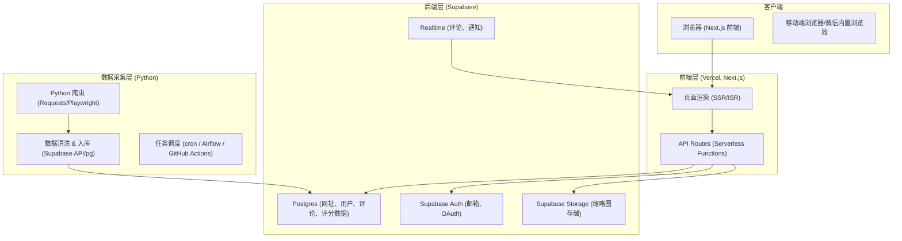

# 游学营地黄页 + 社区（Global Camps Directory & Community）——系统设计说明书

---

## 1 目标概述（High-level）

目标：构建一个全球性的“游学/夏令营/冬令营”信息聚合 + 社区平台，支持：

- 聚合各国营地官网（URL）、缩略图、简介、标签、费用/年龄/时长信息；
    
- 用户评论、评分、收藏、关注、分享与社交（关注/回复/点赞）；
    
- 后台管理、爬虫自动抓取 & 手工审核、图片缩略图生成；
    
- 强搜索（按国家/类型/主题/年龄/价格/评分）与推荐；
    
- 内容审核、反垃圾、防刷、日志审计与合规（特别注意涉未成年人信息与跨境宣传法规）。
    

约束：设计以可扩展、高可用、可监控为目标，方便未来商业化（广告、联动报名/分成）。

---

## 2 总体架构（Logical Components）

系统按功能拆为若干服务/模块（微服务/模块化单体任选，其间通信使用 HTTP/REST + gRPC 或消息队列）：

1. 前端（Web / PWA / 小程序 / 手机 App）
    
2. API 网关（认证、限流、路由）
    
3. 后端服务：
    
    - Listing Service（营地数据管理与展示）
        
    - User Service（用户、认证、社交关系）
        
    - Comment & Rating Service（评论/评分/举报）
        
    - Search Service（索引 & 搜索 API） — ES / OpenSearch
        
    - Media Service（图片存储、缩略图、CDN）
        
    - Crawler & Scraper Service（爬虫 + 抓取队列）
        
    - Content Moderation Service（自动审核 + 管理台）
        
    - Notification Service（邮件、推送、站内信）
        
    - Admin Dashboard（管理、审核、数据运维）
        
    - Analytics Service（统计、热榜、付费转化）
        
4. 数据层：
    
    - RDBMS（PostgreSQL）为主业务存储
        
    - Search Index（Elasticsearch / OpenSearch）
        
    - Cache（Redis）
        
    - Message broker（RabbitMQ / Kafka）
        
    - Object storage（S3 或兼容：MinIO / 阿里 OSS）
        
5. Infra：容器化（Docker）、Kubernetes（建议）、CDN、CI/CD、Monitoring（Prometheus + Grafana）和日志（ELK）。
    

架构图（文字）：

```
Clients -> CDN -> Frontend -> API Gateway -> Backend Services (REST/gRPC)
Backend Services <-> PostgreSQL
SearchService <-> Elasticsearch
MediaService -> S3/CDN
Crawler -> MessageBroker -> ListingService / MediaService
All services -> Logs -> ELK
Metrics -> Prometheus -> Grafana
```

---

## 3 非功能性需求（NFR）

- 可用性：99.9%（单点组件冗余，K8s 多副本）
    
- 扩展性：可水平扩展搜索、爬虫与 API
    
- 性能：常态查询延迟 <200ms（缓存命中时）
    
- 安全：OAuth2 / JWT、密码哈希（bcrypt/argon2）、CSRF、XSS 防护、SQL 注入防护
    
- 隐私合规：处理用户个人数据遵循 GDPR/CCPA/中国网络安全要求（视目标市场逐步合规）
    
- 存储：支持多语言（UTF-8）、多时区数据
    

（注意：具体 SLA/合规需产品 & 法务进一步决策；此处提示设计考虑）

---

## 4 数据模型（核心表结构/字段与关键索引）

下面给出主要业务表的 SQL DDL（PostgreSQL 风格），以便直接用于开发与迁移脚本。

### 4.1 users（用户）

```sql
CREATE TABLE users (
  id BIGSERIAL PRIMARY KEY,
  email VARCHAR(255) UNIQUE,
  phone VARCHAR(32) UNIQUE,
  password_hash VARCHAR(255), -- null if OAuth only
  display_name VARCHAR(100),
  avatar_url TEXT,
  bio TEXT,
  role VARCHAR(20) DEFAULT 'user', -- user, moderator, admin, org
  created_at TIMESTAMP WITH TIME ZONE DEFAULT now(),
  updated_at TIMESTAMP WITH TIME ZONE DEFAULT now(),
  last_login_at TIMESTAMP WITH TIME ZONE
);

CREATE INDEX idx_users_email ON users(email);
```

### 4.2 listings（营地 / 记录）

```sql
CREATE TABLE listings (
  id BIGSERIAL PRIMARY KEY,
  title VARCHAR(300) NOT NULL,
  slug VARCHAR(350) UNIQUE,
  url TEXT NOT NULL,
  country_code CHAR(2), -- ISO2
  region VARCHAR(100),
  city VARCHAR(100),
  language VARCHAR(50),
  description TEXT,
  summary VARCHAR(500),
  tags TEXT[], -- array of tags
  types VARCHAR(50)[], -- e.g. ['summer','language']
  age_min INT,
  age_max INT,
  price_min INT,
  price_max INT,
  duration_days INT,
  thumbnail_url TEXT,
  logo_url TEXT,
  verified BOOLEAN DEFAULT FALSE,
  source VARCHAR(50), -- 'crawler'|'manual'|'partner'
  last_crawled_at TIMESTAMP WITH TIME ZONE,
  created_at TIMESTAMP WITH TIME ZONE DEFAULT now(),
  updated_at TIMESTAMP WITH TIME ZONE DEFAULT now()
);

-- 关键索引
CREATE INDEX idx_listings_country ON listings(country_code);
CREATE INDEX idx_listings_tags ON listings USING GIN (tags);
CREATE INDEX idx_listings_types ON listings USING GIN (types);
CREATE INDEX idx_listings_title_trgm ON listings USING gin (title gin_trgm_ops); -- for fuzzy search
```

### 4.3 comments（评论）

```sql
CREATE TABLE comments (
  id BIGSERIAL PRIMARY KEY,
  listing_id BIGINT REFERENCES listings(id) ON DELETE CASCADE,
  user_id BIGINT REFERENCES users(id) ON DELETE SET NULL,
  parent_id BIGINT REFERENCES comments(id) ON DELETE CASCADE, -- reply threading
  content TEXT NOT NULL,
  content_html TEXT, -- sanitized html
  media_urls TEXT[], -- optional images uploaded with comment
  likes INT DEFAULT 0,
  dislikes INT DEFAULT 0,
  status VARCHAR(20) DEFAULT 'published', -- published|pending|hidden|deleted
  created_at TIMESTAMP WITH TIME ZONE DEFAULT now(),
  updated_at TIMESTAMP WITH TIME ZONE DEFAULT now()
);

CREATE INDEX idx_comments_listing ON comments(listing_id);
```

### 4.4 ratings（评分）

```sql
CREATE TABLE ratings (
  id BIGSERIAL PRIMARY KEY,
  listing_id BIGINT REFERENCES listings(id) ON DELETE CASCADE,
  user_id BIGINT REFERENCES users(id) ON DELETE SET NULL,
  overall SMALLINT CHECK (overall BETWEEN 1 AND 5),
  quality SMALLINT,
  safety SMALLINT,
  environment SMALLINT,
  created_at TIMESTAMP WITH TIME ZONE DEFAULT now(),
  UNIQUE (listing_id, user_id)
);

CREATE INDEX idx_ratings_listing ON ratings(listing_id);
```

### 4.5 favorites（收藏）

```sql
CREATE TABLE favorites (
  user_id BIGINT REFERENCES users(id) ON DELETE CASCADE,
  listing_id BIGINT REFERENCES listings(id) ON DELETE CASCADE,
  created_at TIMESTAMP WITH TIME ZONE DEFAULT now(),
  PRIMARY KEY (user_id, listing_id)
);
```

### 4.6 follows（用户关注）

```sql
CREATE TABLE follows (
  follower_id BIGINT REFERENCES users(id) ON DELETE CASCADE,
  followee_id BIGINT REFERENCES users(id) ON DELETE CASCADE,
  created_at TIMESTAMP WITH TIME ZONE DEFAULT now(),
  PRIMARY KEY (follower_id, followee_id)
);
```

### 4.7 reports（举报）

```sql
CREATE TABLE reports (
  id BIGSERIAL PRIMARY KEY,
  reporter_id BIGINT REFERENCES users(id),
  target_type VARCHAR(20), -- 'comment'|'listing'|'user'
  target_id BIGINT,
  reason TEXT,
  status VARCHAR(20) DEFAULT 'open', -- open|in_review|resolved
  created_at TIMESTAMP WITH TIME ZONE DEFAULT now(),
  reviewed_by BIGINT REFERENCES users(id),
  reviewed_at TIMESTAMP WITH TIME ZONE
);
```

### 4.8 media (图片与缩略图 metadata)

```sql
CREATE TABLE media (
  id BIGSERIAL PRIMARY KEY,
  owner_type VARCHAR(20), -- 'listing'|'comment'|'user'|'other'
  owner_id BIGINT,
  original_url TEXT, -- s3/oss path
  thumb_url TEXT,
  width INT,
  height INT,
  format VARCHAR(50),
  created_at TIMESTAMP WITH TIME ZONE DEFAULT now()
);
CREATE INDEX idx_media_owner ON media(owner_type, owner_id);
```

> 备注：以上表是核心，实际还有 audit_logs、sessions、rate_limits、jobs、crawler_queue 等表。

---

## 5 Search / Index 设计（Elasticsearch / OpenSearch）

- 将 `listings` 与 `comments` 同步到 ES 索引，支持多字段查询 & 多语言分词（en/zh/jp/...）。
    
- Listing 索引字段示例：
    
    - id, title (text, ngram + standard analyzer), summary, description, country_code, city, tags, types, price_min, age_min, verified, avg_rating, popularity_score
        
- 建议使用 per-field analyzers，title 用 edge_ngram 用于前缀搜索；description 用 standard analyzer；中文使用 ik_max_word 分词器（或官方分词插件）。
    
- 排序权重：默认按 `boost = verified * 2 + avg_rating * 1.5 + popularity * 0.5 + recency_weight`。
    

同步策略：使用消息队列（RabbitMQ/Kafka）把 DB 变更事件送到 `indexer` 服务，异步更新 ES。

---

## 6 API 设计（重要端点：示例 OpenAPI 风格）

### 6.1 Auth

- `POST /api/v1/auth/register` — {email, password, display_name}
    
- `POST /api/v1/auth/login` — {email, password} -> returns `access_token` (JWT) + refresh token
    
- `POST /api/v1/auth/oauth/callback` — OAuth 登录回调
    

### 6.2 Listing（营地）

- `GET /api/v1/listings` — 查询列表，支持参数：q, country_code, city, tags[], types[], age_min, age_max, price_min, price_max, sort, page, size
    
- `GET /api/v1/listings/{id}` — 获取详情（包含 avg_rating、top_comments、related）
    
- `POST /api/v1/listings` — 创建（管理员/partner 或经审核）
    
- `PUT /api/v1/listings/{id}` — 更新（owner 或 admin）
    
- `POST /api/v1/listings/{id}/verify` — 标记为 verified（仅 admin）
    

示例查询请求：

```
GET /api/v1/listings?q=language+camp&country_code=GB&types=summer&page=1&size=20&sort=popularity
```

### 6.3 Comments & Ratings

- `POST /api/v1/listings/{id}/comments` — {content, parent_id?, media_ids[]}
    
- `GET /api/v1/listings/{id}/comments` — pagination & sort
    
- `POST /api/v1/listings/{id}/ratings` — {overall, quality, safety, environment}
    
- `GET /api/v1/listings/{id}/ratings/summary` — {avg_overall, count, distribution}
    

### 6.4 Social

- `POST /api/v1/users/{id}/follow`
    
- `GET /api/v1/users/{id}/followers`
    
- `GET /api/v1/users/{id}/following`
    
- `POST /api/v1/favorites` — add/push
    

### 6.5 Admin

- `GET /api/v1/admin/reports`
    
- `POST /api/v1/admin/inspect/comment/{comment_id}/action` — hide/approve/delete
    
- `GET /api/v1/admin/crawler/jobs`
    

### 6.6 Media Upload/Thumbs

- `POST /api/v1/media/upload` — 返回预签名 S3 URL 或直接上传
    
- `GET /api/v1/media/{id}/thumb` — redirect to thumb_url (CDN)
    

---

## 7 爬虫与数据采集（Crawler / Scraper）

目标：自动发现与周期性抓取全球营地信息并提取结构化字段 + 缩略图。

### 7.1 组成

- Seed 管理：初始 URL 来源（手工录入、合作机构、第三方目录、搜索引擎采集）
    
- Crawler Scheduler：控制并发、排重（使用 bloomfilter / URL fingerprint）、速率限制（respect robots.txt）
    
- Scraper Workers：基于 Playwright（能渲染 JS）+ BeautifulSoup/XPath/Regex 解析字段
    
- Thumbnail Generator：使用 Playwright/Puppeteer 截图或抓取 OG:image
    
- Extractor：抽取 title/meta, description, contact info, price info（结构化）
    
- Normalizer：将不同货币/语言/格式标准化
    
- Deduper：根据域名、标题、指纹检测重复
    
- Enrichment：Geo-IP -> 国家/城市、语言检测、自动打标签（NLP）
    
- Crawler Queue：RabbitMQ/Kafka 保持任务持久化
    

### 7.2 抓取频率

- 热门/变更频率高的站点：每日或每 6 小时
    
- 常规站点：每周
    
- 已下线或 404：退役处理并通知人工
    

### 7.3 风险与合规

- 尊重 robots.txt 与反爬机制
    
- 不抓取或镜像受版权保护的内容（完整文章、付费内容）
    
- 图片缩略图尽量抓取 `og:image` 并记录源，推荐与机构签订图片使用/替换协议
    

---

## 8 媒体（图片/缩略图）与 CDN

- 上传：用户上传 -> 预签名 URL -> S3/OSS 存储
    
- 缩略图：Media Service 使用 `libvips` 或 `ImageMagick` 批量生成多尺寸
    
- 截图：Playwright 截取网页关键视图（保存原图 + 生成多尺寸）
    
- CDN：所有静态资源通过 CDN（CloudFront、阿里 CDN）分发
    
- 权利：保留 source_url 与 license 字段，便于日后版权核验
    

---

## 9 内容审核（自动化 + 人工）

### 9.1 自动化层

- 敏感词库（多语种） + DFA / Aho-corasick 检测
    
- 图像内容检测（第三方 API：阿里云/腾讯云/Google Vision 或内部模型）检测成人、暴力、政治敏感与未成年人隐私风险
    
- 垃圾评论检测：基于模型的 spam classifier（特征：短长、外链频次、重复文本、账户新鲜度）
    
- 评分异常检测（同 IP 多账户评分、短时间大量评分）
    

### 9.2 人工审核

- 报表式工作台（Admin Dashboard）列展示待审内容、可打标签、评论操作、处罚（封号/删除）
    
- 审核流程：自动标“pending” -> 人工判定 -> 通过/屏蔽
    
- 审核日志保存（审计）
    

### 9.3 异常与举报处理

- 支持用户举报并在 24-72 小时内处理（根据法务/合规规定）
    

---

## 10 实时与通知

- WebSocket 或 Web Push 用于：
    
    - 评论实时推送（小范围：用户正在查看页面）
        
    - 站内消息（有人回复、有人关注、审核结果）
        
- Notification Service：
    
    - 邮件（SendGrid / 阿里云邮件）
        
    - 推送（APNs, FCM）
        
    - 内部队列统一处理 & 限流
        

---

## 11 推荐系统（基础）

- 初期用基于规则的推荐：
    
    - 热门（点击量、收藏数、评分）
        
    - 同城/同标签推荐
        
- 中后期引入协同过滤 & content-based 推荐（基于用户行为日志）
    
- 离线 batch job 用 Spark/Presto 统计用户-物品矩阵并生成推荐候选，实时结合 Redis 缓存
    

---

## 12 安全与隐私要点

- 密码用强哈希（argon2/bcrypt），JWT 带短期有效期 + refresh token 存 DB 可撤销
    
- 图片/媒体要记录原始来源与许可，避免侵权
    
- 对未成年人内容要额外保护（如果涉及照片：要求上传者确认权利，或自动模糊面部）
    
- 敏感操作（标记、删除、验证）需记录审计日志
    
- API 防刷/限流（IP + user token），评论等关键操作需验证码（图片/短信）根据风险升降级
    

---

## 13 测试策略（开发到生产）

### 13.1 单元测试

- Backend：各 service 的单元测试（pytest / jest）
    
- DB 模块：migration + 模拟 DB 测试
    

### 13.2 集成测试

- API 测试（Postman / pytest + testcontainers）
    
- Media pipeline 测试（上传 -> thumb -> CDN link）
    

### 13.3 端到端（E2E）

- 前端关键流程（注册/登录/搜索/评论/上传）用 Playwright / Cypress
    

### 13.4 性能与压力测试

- 使用 k6 / Gatling 模拟搜索流量、爬虫抓取压力、写入高并发（评论/评分）
    

### 13.5 安全测试

- SAST（CodeQL）、依赖漏洞扫描（Snyk）、定期渗透测试
    

### 13.6 自动化 & CI

- GitHub Actions / GitLab CI / Jenkins：代码检查 -> 单元测试 -> 镜像构建 -> 部署到 staging -> E2E 测试 -> promote
    

---

## 14 部署 & 运维（建议）

### 14.1 基础设施（推荐）

- Container registry + Docker images
    
- Kubernetes cluster (EKS/GKE/AKS 或自建 K8s)
    
- PostgreSQL 高可用（AWS RDS / 云 DB 或 Patroni）
    
- Elasticsearch managed 或自建（HA & snapshot）
    
- Redis (cluster)
    
- RabbitMQ / Kafka for queueing
    
- S3 (对象存储) + CDN
    

### 14.2 CI/CD

- 分支策略：main（生产），staging，feature/*
    
- 自动化 pipelines：lint -> test -> image build -> deploy (helm charts)
    

### 14.3 监控/告警

- Metrics: Prometheus -> Grafana dashboards
    
- Logs: ELK Stack（Elastic 或 OpenSearch）或 Loki
    
- Tracing: Jaeger / OpenTelemetry
    
- Alerts: PagerDuty / Opsgenie integrations
    

### 14.4 数据 & Backup

- RDS automated snapshots daily + point-in-time recovery
    
- ES snapshot daily to S3
    
- S3 lifecycle + GDPR-compliant deletion on user request
    

### 14.5 灾备

- Key services跨可用区部署，DB 冗余，恢复演练（DR drills）
    

---

## 15 可扩展 / 可迭代的 MVP & Roadmap（功能优先级）

（为便于工程落地，我把功能按首发 MVP / v1 / v2 分类，但未给时间估计）

### MVP（必须先做）

- 基本 listings 存储与展示（手工导入 + 简单爬虫）
    
- 搜索（基本关键字，按国家/类型筛选）
    
- 用户注册/登录（邮箱 + OAuth）
    
- 评论 + 评分（发布/查看/点赞）
    
- Media upload + thumbnail + CDN
    
- 管理后台：内容审核、手动添加/编辑 listing
    
- 基本防刷（频率限流）
    

### v1（增强）

- 高级搜索（ES），相关性排序，推荐（热门）
    
- 爬虫规模化 & 自动化 thumbnail
    
- 报表/Analytics（热榜）
    
- 举报/审核流程完善
    
- 用户关注/社交（follow）、收藏
    

### v2（社区+商业）

- 实时通知（WebSocket）、社交 feed、私信
    
- Partner program（认证机构账户）
    
- 广告位 & 合作报名/转化追踪
    
- 国际化 & 多货币支持
    
- 推荐系统（机器学习）
    

---

## 16 开发者交付件（对 Coding Agent / 开发团队）

为确保开发者能直接开工，建议交付以下 artifact（我按优先级列出）：

1. **数据库 migrations 与 SQL DDL**（已给出表结构，扩展脚本）
    
2. **OpenAPI Spec（YAML/JSON）** 完整接口定义（上述示例需扩充）
    
3. **Dockerfile + Helm charts**（部署模板）
    
4. **CI pipeline 脚本**（lint, test, build, deploy）
    
5. **爬虫任务 & extractor 规则 template**（Playwright job + XPath/selector 模板）
    
6. **ES mapping 文件**（索引映射）
    
7. **Admin Dashboard wireframes & RBAC rules**
    
8. **测试计划文件**（单元/集成/E2E 案例）
    
9. **Monitoring dashboards & alert rules 清单**
    

---

## 17 示例：关键 SQL / API 使用示例

### 17.1 计算某 listing 的平均评分（SQL）

```sql
SELECT listing_id,
       ROUND(AVG(overall)::numeric,2) as avg_overall,
       COUNT(*) as votes
FROM ratings
WHERE listing_id = 123
GROUP BY listing_id;
```

### 17.2 评论创建 API 请求（示例）

```
POST /api/v1/listings/123/comments
Authorization: Bearer <jwt>
Body:
{
  "content": "My child loved the language camp — teachers were excellent!",
  "media_ids": [456, 457],
  "parent_id": null
}
```

### 17.3 ES 查询（示例）

搜索英语营地（英国）并按评分与近 90 天热度排序：

```json
{
  "query": {
    "bool": {
      "must": [
         { "match": { "types": "language" }},
         { "term": { "country_code": "GB" }}
      ]
    }
  },
  "sort": [
    { "avg_rating": "desc" },
    { "popularity_score": "desc" }
  ],
  "size": 20
}
```

---

## 18 可替代技术栈与权衡（短评）

- RDBMS：Postgres 推荐；若团队熟悉 MySQL 也可。
    
- Search：Elasticsearch / OpenSearch；若预算有限，可先用 PostgreSQL 的全文搜索，后续迁 ES。
    
- Message broker：RabbitMQ（任务队列易用）或 Kafka（更适合大数据 pipeline）。
    
- Crawl：Scrapy + Playwright；Playwright 更适合 JS-heavy 网站。
    
- Infra：如果不想运维 K8s，可用云 PaaS（Heroku/Render）+ managed DB + managed ES。
    

---

## 19 运维 & 合规注意（重点提示）

1. **未成年人保护**：若允许用户上传涉及未成年人的照片，需在用户协议中明确权利并提供父母/监护人同意流程，或自动模糊面部；法律风险需法务确认。
    
2. **图片版权**：在抓取第三方图片时保留 `source_url` 与 `license`，若图片受版权保护，优先请求合作或使用站方替代图。
    
3. **广告/内容合规**：跨国宣传可能触及教育出境宣传法规（不同国家/地区），上线前与当地法务沟通。
    
4. **GDPR/数据删除**：实现用户数据导出/删除流程（Right to be forgotten）。
    

---

## 20 交付清单（立刻可用的工程产物）

- 数据库 DDL（附注：可直接作为 migration 起点）
    
- API 列表（必须实现端点）
    
- ES mapping 建议
    
- Crawler job 模板（Playwright + extractor selector）
    
- Admin 审核流程 blueprint
    
- 测试cases（常用用例清单）
    
- 运维监控与告警清单
    

---

## 21 最后：开发建议 & 风险优先级

1. **先做数据质量**：聚合类产品的核心是数据。早期以少量高质量手工导入 + 强爬虫策略为主，逐步放大自动化。
    
2. **先做评论/评分与审核机制**：口碑是平台核心壁垒，务必建立反垃圾/审核通道，避免被刷或被恶意利用。
    
3. **图像与版权**：缩略图尽量使用 `og:image` 并记录来源；若机构愿意合作，优先拿到官方图与认证。
    
4. **运营指标**：从 Day1 开始埋点（PV/UV、收藏率、转化率、举报率、审核通过率），为推荐与商业化打基础。
    

---
 
 MVP 技术栈是：

- **前端**：Next.js（React 全栈框架，SEO 友好，支持 SSR/ISR），部署在 **Vercel**
    
- **后端服务**：Supabase（Postgres + Auth + Realtime + Storage），充当 BaaS
    
- **数据采集**：Python 爬虫（定时抓取夏令营/冬令营相关网址 + 简介 + 缩略图），可跑在独立服务器/Cloud Function
    
- **社交功能**：基于 Supabase Realtime/DB 实现评论、评分、关注等
    
- **认证 & 安全**：Supabase Auth（邮箱/第三方登录）+ 中间件鉴权
    

下面我以 **资深系统架构师**身份，为你输出一份完整的 **系统设计说明书 (MVP 版本)**：

---

# 游学黄页独立站 - 系统设计说明书（MVP）

## 1. 项目概述

该系统是一个聚合全球夏令营/冬令营信息的独立站，具备黄页式目录检索功能，并增加社交互动（评论、评分、关注、分享）。MVP 使用 **Next.js + Supabase + Python 爬虫** 技术栈，前端托管于 Vercel，后端数据库与认证由 Supabase 提供。

目标：快速上线一个可用的 MVP 平台，验证用户需求与市场可行性。

---

## 2. 系统架构设计

### 2.1 总体架构



---

## 3. 功能模块设计

### 3.1 用户体系

- **注册登录**：邮箱 / Google / 微信 / Apple ID
    
- **用户资料**：头像、昵称、兴趣标签、收藏、历史评论
    
- **角色**：普通用户、认证营地主办方、管理员
    

### 3.2 网址目录

- 按地区 / 国家 / 类型分类（夏令营、冬令营、游学、线上营）
    
- 支持搜索（模糊匹配 + 分类过滤）
    
- 每个条目含：标题、官网链接、简介、缩略图、评分
    

### 3.3 评论与评分

- 评论（文字 + 图片）
    
- 评分（1–5 星，按维度：课程质量 / 师资 / 环境 / 安全）
    
- 点赞、踩、举报
    
- 评论排序：最新、热门、评分高低
    

### 3.4 社交互动

- 用户可关注其他用户
    
- 评论区 @ 他人 / 回复
    
- 分享功能（社交平台分享）
    

### 3.5 管理后台（MVP 可简化）

- 管理员审核网址信息（增删改查）
    
- 审核/屏蔽违规评论
    
- 导出数据分析（营地数量、活跃用户、热门营地）
    

### 3.6 爬虫任务

- Python 爬虫定时抓取各国夏令营/冬令营官网数据
    
- 爬取内容：官网 URL、标题、简介、缩略图（截图）
    
- 存储到 Supabase DB + Storage
    
- 定期去重 & 更新
    

---

## 4. 数据库设计（Supabase Postgres）

### 4.1 用户表

```sql
Table: users
- id (uuid, pk)
- email (text, unique)
- nickname (text)
- avatar_url (text)
- bio (text)
- interests (text[]) -- 兴趣标签
- role (enum: user/organizer/admin)
- created_at (timestamptz)
```

### 4.2 网址表

```sql
Table: campsites
- id (uuid, pk)
- name (text)
- url (text, unique)
- country (text)
- category (enum: summer, winter, study, online)
- description (text)
- thumbnail_url (text)
- avg_rating (numeric)
- created_at (timestamptz)
- updated_at (timestamptz)
```

### 4.3 评论表

```sql
Table: comments
- id (uuid, pk)
- user_id (uuid, fk -> users.id)
- campsite_id (uuid, fk -> campsites.id)
- cont(text)
- images (text[]) -- 评论配图
- likes (int)
- dislikes (int)
- created_at (timestamptz)
```

### 4.4 评分表

```sql
Table: ratings
- id (uuid, pk)
- user_id (uuid, fk -> users.id)
- campsite_id (uuid, fk -> campsites.id)
- score_quality (int)
- score_facility (int)
- score_safety (int)
- score_overall (int)
- created_at (timestamptz)
```

### 4.5 关注关系

```sql
Table: follows
- follower_id (uuid, fk -> users.id)
- following_id (uuid, fk -> users.id)
- created_at (timestamptz)
```

### 4.
```sql
Table: reports
- id (uuid, pk)
- reporter_id (uuid, fk -> users.id)
- comment_id (uuid, fk -> comments.id)
- reason (text)
- status (enum: pending, reviewed, rejected)
- created_at (timestamptz)
```

---

## 5. 技术选型

### 5.1 前端

- Next.js 14 (App Router + ISR/SSR)
    
- TailwindCSS (UI)
    
- React Query/SWR（数据请求缓存）
    
- 部署：Vercel
    

### 5.2 后端（BaaS）

- Supabase（Postgres + Auth + Storage + Realtime）
    
- Edge Functions（可写自定义 API，æ）
    

### 5.3 爬虫

- Python（Requests, BeautifulSoup, Playwright/selenium 截图）
    
- 定时任务：GitHub Actions / Supabase Cron / Airflow
    
- 数据入库：Supabase REST API / Python `supabase-py` SDK
    

---

## 6. 开发流程

1. **阶段一：基础框架**
    
    - Next.js 前端搭建 + Supabase 连接
        
    - 用户登录/注册 + 个人主页
        
    - 网址目录页（静态+SSR 渲染）
        
2. **阶段二：互动功能**
    
    - 评论/评分功能å - 关注/分享功能开发
        
    - Supabase Realtime 推送
        
3. **阶段三：爬虫接入**
    
    - Python 爬虫采集 20–50 个营地
        
    - 数据入库 Supabase
        
    - 前端展示缩略图+简介
        
4. **阶段四：部署与测试**
    
    - 前端部署到 Vercel
        
    - 爬虫定时任务上线（GitHub Actions）
        
    - 灰度发布，收集用户反馈
        

---

## 7. 测试 & 验证

- **单元测试**：Next.js API Routes + SupSDK 测试
    
- **集成测试**：前端与后端联调
    
- **负载测试**：爬虫入库压力测试
    
- **用户测试**：收集首批用户反馈
    

---

## 8. 部署架构

- **前端**：Next.js -> Vercel
    
- **数据库/存储/认证**：Supabase Cloud
    
- **爬虫**：Python 脚本 -> GitHub Actions (每日定时跑)
    
- **日志 & 监控**：Supabase Logs + Vercel Analytics
    

---

⚡ 总结：  
这套 **Next.js + Supabase + Python 爬虫** 架构，可以快速搭建并上线一个带评论、评分、社交互动的游学黄页 MVP，且具备未来扩展到完整社区/电商化平台的潜力。

---
